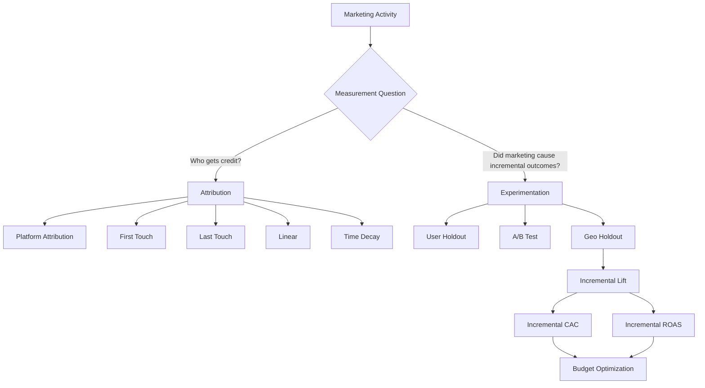
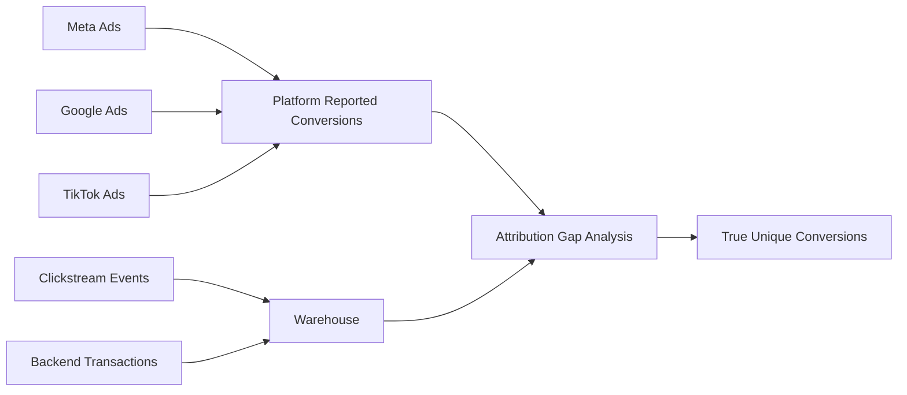
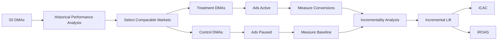
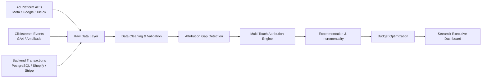

# Multi-Touch Attribution & Incrementality Analytics

[](https://www.python.org/)
[](https://www.postgresql.org/)
[](https://streamlit.io/)
[](https://opensource.org/licenses/MIT)

An end-to-end marketing measurement system that evaluates **true campaign performance across Meta, Google Search, and TikTok**.

**[Dashboard](https://jennypark-attribution-analytics.streamlit.app/)**

The project combines:

- Marketing Measurement
- Multi-Touch Attribution in SQL
- Attribution Gap Detection
- Geo-Holdout Experimentation
- Incrementality Measurement
- Incremental CAC and ROAS
- Marketing Budget Optimization

The goal is to answer a question that platform dashboards alone cannot:

> **Which marketing channels are actually generating incremental customers and revenue — rather than simply claiming credit for conversions that would have happened anyway?**

---

# Table of Contents

- [Executive Summary](#executive-summary)
- [Business Problem](#business-problem)
- [Key Findings & Business Recommendation](#key-findings--business-recommendation)
- [Measurement Framework](#measurement-framework)
- [Attribution Gap Detection](#attribution-gap-detection)
- [Multi-Touch Attribution Engine](#multi-touch-attribution-engine)
- [Experimentation & Incrementality](#experimentation--incrementality)
- [Data Architecture & Pipeline](#data-architecture--pipeline)
- [Data Provenance](#data-provenance)
- [Technical Highlights](#technical-highlights)
- [Repository Structure](#repository-structure)
- [Quickstart](#quickstart)

---

# Executive Summary

Modern marketing teams face a fundamental measurement problem:

## Ad platforms report conversions they can observe — but not necessarily conversions they caused.

Meta, Google, and TikTok may all claim credit for the same customer journey.

At the same time, retargeting campaigns may receive attribution for customers who were already likely to purchase through:

- Organic Search
- Direct Traffic
- Brand Awareness
- Existing Customer Intent

This creates two different measurement problems.

---

## 1. Attribution

### Which channels should receive credit for a conversion?

The SQL attribution engine reconstructs customer journeys and compares multiple attribution models:

1. First-Touch
2. Last-Touch
3. Linear
4. Time-Decay
5. Position-Based (U-Shaped)

---

## 2. Incrementality

### Which marketing activities actually caused additional conversions?

The experimentation framework estimates the number of conversions that occurred **because of marketing activity and would not have happened otherwise**.

The project uses a 30-day geo-holdout experiment to estimate:

- Incremental Conversions
- Incremental Lift
- Incremental Revenue
- Incremental CAC
- Incremental ROAS

---

# Key Findings & Business Recommendation

## Key Finding

Platform-reported conversions overstated combined paid media performance by **34%** due to:

1. Duplicate cross-channel attribution
2. Platform self-attribution bias
3. Low-incrementality retargeting activity

---

## Channel Performance Comparison

| Channel                |        Spend | Platform ROAS | Attributed ROAS | Incremental ROAS | Strategic Decision            |
| ---------------------- | -----------: | ------------: | --------------: | ---------------: | ----------------------------- |
| **Meta Paid Social**   |     $120,000 |     **3.25x** |           1.46x |        **1.26x** | 📉 Reduce retargeting         |
| **Google Paid Search** |      $95,000 |     **2.80x** |           3.10x |        **2.65x** | 📈 Increase high-intent spend |
| **TikTok Ads**         |      $45,000 |     **1.60x** |           2.45x |        **2.10x** | 🚀 Scale prospecting          |
| **Blended**            | **$260,000** |     **2.80x** |       **2.24x** |        **1.91x** | Reallocate budget             |

---

# Business Recommendation

Reallocate **$100,000 in quarterly marketing spend**:

```text
FROM

Meta Retargeting
$60,000

+

Low-Performing Campaigns
$40,000

↓

TO

Google High-Intent Search
$55,000

+

TikTok Prospecting
$45,000
```

---

## Expected Impact

- Blended CAC ↓ **14.2%**
- Higher incremental customer acquisition
- Higher incremental revenue
- Reduced dependence on platform-reported metrics
- Better allocation of marginal marketing spend

---

## Executive Decision Framework

The final Streamlit application enables marketing leaders to compare:

```text
Platform ROAS

↓

Attributed ROAS

↓

Incremental ROAS

↓

Budget Decision
```

The goal is to move from:

> "Which platform claims the most conversions?"

to:

> **"Where should we invest the next marketing dollar?"**

---

# Business Problem

A D2C technology company spends:

```text
$260,000 / Month
```

across:

- Meta Ads
- Google Search
- TikTok Ads

Each advertising platform reports its own conversions and revenue.

However:

```text
Meta
Claims 5,000 conversions

Google
Claims 4,000 conversions

TikTok
Claims 2,000 conversions

↓

Total Platform Claims

11,000 conversions
```

The backend warehouse shows:

```text
Actual Unique Customers

8,200
```

This creates an **Attribution Gap**.

---

# Measurement Framework

Different measurement methods answer different business questions.

| Measurement Method      | Business Question                                                         |
| ----------------------- | ------------------------------------------------------------------------- |
| Platform Attribution    | Which conversions does the ad platform claim?                             |
| Multi-Touch Attribution | Which channels should receive credit across the customer journey?         |
| Incrementality Testing  | Did marketing activity cause additional conversions?                      |
| Holdout Experiment      | What happens when a comparable group does not receive marketing exposure? |
| Geo Experiment          | What is the causal impact of marketing across geographic markets?         |

---

## Measurement Architecture



---

# Attribution Gap Detection

Before assigning attribution credit, the system compares conversion data across multiple sources.



---

## Example

### Platform Reported Conversions

| Platform                  | Reported Conversions |
| ------------------------- | -------------------: |
| Meta                      |                5,000 |
| Google                    |                4,000 |
| TikTok                    |                2,000 |
| **Total Platform Claims** |           **11,000** |

---

### Warehouse

```text
Unique Converted Customers

8,200
```

---

### Attribution Gap

```text
Platform Claimed Conversions

11,000

-

Unique Warehouse Conversions

8,200

=

2,800 Duplicate / Overlapping Claims
```

---

## Business Value

Attribution Gap Detection helps identify:

- Duplicate conversion claims
- Double-counted revenue
- Missing UTM parameters
- Tracking failures
- Pixel double-firing
- Platform reporting discrepancies

---

# Multi-Touch Attribution Engine

Platform reporting usually follows each platform's own attribution logic.

This project reconstructs the full customer journey from warehouse-level event data.

Example:

```text
Day 1

TikTok Ad

↓

Day 4

Google Search

↓

Day 7

Meta Retargeting

↓

Day 8

Purchase
```

Different attribution models produce different conclusions.

---

## First-Touch Attribution

```text
TikTok

Receives 100% credit
```

Useful for:

- Top-of-funnel measurement
- Acquisition analysis
- Awareness evaluation

---

## Last-Touch Attribution

```text
Meta

Receives 100% credit
```

Useful for:

- Conversion analysis
- Bottom-of-funnel campaigns

---

## Linear Attribution

```text
TikTok

33%

Google

33%

Meta

33%
```

Useful for:

- Multi-channel journey analysis

---

## Time-Decay Attribution

More credit is assigned to touchpoints closer to conversion.

```text
TikTok

15%

↓

Google

30%

↓

Meta

55%
```

---

## Important Limitation

Multi-Touch Attribution answers:

> **Who should receive credit?**

It does **not** answer:

> **Would the conversion have happened without advertising?**

That question requires experimentation and incrementality measurement.

---

# Experimentation & Incrementality

## What Is Incrementality?

Incrementality measures the causal impact of marketing.

The question is:

> **How many conversions occurred because of marketing activity that would not have happened otherwise?**

---

## Example

A platform reports:

```text
10,000 conversions
```

But an experiment estimates:

```text
Expected baseline conversions

8,000
```

Therefore:

```text
Actual conversions

10,000

-

Expected baseline conversions

8,000

=

2,000 incremental conversions
```

---

## Platform CAC vs Incremental CAC

### Platform CAC

```text
Marketing Spend

÷

Platform Reported Conversions
```

### Incremental CAC

```text
Marketing Spend

÷

Incremental Conversions
```

These can produce dramatically different results.

---

# Geo-Holdout Experiment

This project uses a 30-day geo-holdout experiment.

Markets are divided into:

## Treatment DMAs

```text
Meta Ads

ACTIVE
```

## Control DMAs

```text
Meta Ads

PAUSED
```

The goal is to estimate:

> What would treatment market conversions have looked like without advertising?

---

## Experiment Design



---

# Incrementality Metrics

## Incremental Conversions

```text
Actual Treatment Conversions

-

Expected Baseline Conversions
```

---

## Incremental Lift

```text
Incremental Conversions

÷

Expected Baseline Conversions
```

---

## Incremental CAC

```text
Ad Spend

÷

Incremental Conversions
```

---

## Incremental Revenue

```text
Incremental Conversions

×

Revenue Per Conversion
```

---

## Incremental ROAS

```text
Incremental Revenue

÷

Ad Spend
```

---

# Geo-Holdout Insight

During the experiment:

```text
Meta Ads

PAUSED

in

10 Control DMAs
```

The analysis showed that a significant portion of conversions attributed to Meta continued to occur through:

- Organic Search
- Direct Traffic
- Existing Customer Intent

This indicates that Meta retargeting was receiving attribution credit for conversions with relatively low incremental lift.

---

# Data Architecture & Pipeline



---

# Data Provenance

## Note on Synthetic Data

The datasets in this repository are synthetically generated for public reproducibility.

They simulate common production-level marketing measurement problems including:

- UTM inconsistencies
- Duplicate events
- Pixel double-firing
- Cross-channel attribution overlap
- Platform over-reporting
- Missing campaign metadata
- Organic conversion cannibalization

The schema and analytical workflow are designed to reflect real-world marketing analytics pipelines while keeping proprietary company data private.

---

# Data Sources

## 1. raw_ad_spend.csv

### Simulated Sources

- Meta Ads API
- Google Ads API
- TikTok Ads API

### Contains

- Date
- Channel
- Campaign
- DMA
- Spend
- Impressions
- Clicks
- Platform-reported conversions

---

## 2. raw_user_touchpoints.csv

### Simulated Sources

- GA4
- Amplitude
- Segment
- CDP Event Logs

### Contains

- user_id
- timestamp
- channel
- campaign
- utm_source
- utm_medium
- utm_campaign
- dma_code

---

## 3. raw_conversions.csv

### Simulated Sources

- PostgreSQL
- Shopify
- Stripe

### Contains

- user_id
- conversion_timestamp
- order_id
- order_value_usd
- conversion_status

This dataset represents the warehouse-level source of truth for verified conversions.

---

# Technical Highlights

# 1. SQL Window Functions for Customer Journeys

The attribution engine uses:

- CTEs
- ROW_NUMBER()
- FIRST_VALUE()
- LAST_VALUE()
- LAG()
- LEAD()
- SUM() OVER()

to reconstruct chronological customer journeys.

```sql
WITH conversion_touchpoints AS (

    SELECT
        t.user_id,
        t.event_id,
        t.channel,
        t.timestamp AS touchpoint_timestamp,
        c.conversion_timestamp,
        c.order_value_usd,

        ROW_NUMBER() OVER (
            PARTITION BY t.user_id, c.order_id
            ORDER BY t.timestamp
        ) AS touchpoint_order,

        COUNT(*) OVER (
            PARTITION BY t.user_id, c.order_id
        ) AS total_touchpoints,

        EXTRACT(
            EPOCH FROM (
                c.conversion_timestamp - t.timestamp
            )
        ) / 86400.0 AS days_before_conversion

    FROM user_touchpoint_events t

    INNER JOIN user_conversions c
        ON t.user_id = c.user_id

    WHERE t.timestamp <= c.conversion_timestamp

),

time_decay_weights AS (

    SELECT
        user_id,
        channel,
        order_value_usd,

        POW(
            2,
            -days_before_conversion / 7.0
        ) AS weight

    FROM conversion_touchpoints

),

normalized_weights AS (

    SELECT
        *,
        SUM(weight) OVER (
            PARTITION BY user_id
        ) AS total_weight

    FROM time_decay_weights

)

SELECT
    channel,

    ROUND(
        SUM(
            order_value_usd
            *
            (weight / total_weight)
        ),
        2
    ) AS attributed_revenue

FROM normalized_weights

GROUP BY channel

ORDER BY attributed_revenue DESC;
```

---

# 2. Attribution Gap Analysis

The system compares:

```text
Platform Reported Conversions

vs

Warehouse Unique Conversions

vs

Backend Revenue
```

Example output:

| Metric                       |  Value |
| ---------------------------- | -----: |
| Platform Claimed Conversions | 11,000 |
| Warehouse Unique Conversions |  8,200 |
| Attribution Gap              |  2,800 |
| Over-reporting Rate          |    34% |

---

# 3. Incrementality Analysis

```python
import pandas as pd
import numpy as np


def calculate_incrementality(
    treatment_df: pd.DataFrame,
    control_df: pd.DataFrame,
    ad_spend: float,
    revenue_per_conversion: float
):

    """
    Estimate incremental marketing impact
    using a geo-holdout experiment.
    """

    control_conversion_rate = (
        control_df["conversions"].sum()
        /
        control_df["population"].sum()
    )

    expected_baseline_conversions = (
        treatment_df["population"].sum()
        *
        control_conversion_rate
    )

    actual_treatment_conversions = (
        treatment_df["conversions"].sum()
    )

    incremental_conversions = (
        actual_treatment_conversions
        -
        expected_baseline_conversions
    )

    incremental_lift_pct = (
        incremental_conversions
        /
        expected_baseline_conversions
        if expected_baseline_conversions > 0
        else np.nan
    )

    incremental_revenue = (
        incremental_conversions
        *
        revenue_per_conversion
    )

    incremental_cac = (
        ad_spend
        /
        incremental_conversions
        if incremental_conversions > 0
        else np.inf
    )

    incremental_roas = (
        incremental_revenue
        /
        ad_spend
        if ad_spend > 0
        else np.nan
    )

    return {

        "expected_baseline_conversions":
            round(expected_baseline_conversions),

        "actual_treatment_conversions":
            round(actual_treatment_conversions),

        "incremental_conversions":
            round(incremental_conversions),

        "incremental_lift_pct":
            round(incremental_lift_pct * 100, 2),

        "incremental_revenue_usd":
            round(incremental_revenue, 2),

        "incremental_cac_usd":
            round(incremental_cac, 2),

        "incremental_roas":
            round(incremental_roas, 2)

    }
```

---

# Dashboard

The Streamlit application provides an executive-level view of marketing performance.

## Dashboard Pages

### 1. Executive Summary

```text
Total Spend

Total Revenue

Blended CAC

Incremental ROAS
```

---

### 2. Attribution Comparison

Compare:

- Platform Attribution
- First-Touch
- Last-Touch
- Linear
- Time-Decay
- Position-Based (U-Shaped)

---

### 3. Attribution Gap

Compare:

```text
Platform Claims

vs

Warehouse Conversions

vs

Backend Revenue
```

---

### 4. Incrementality

Visualize:

- Treatment vs Control
- Conversion Lift
- Incremental Conversions
- Incremental CAC
- Incremental ROAS

---

### 5. Budget Optimizer

Scenario:

```text
Move Budget

FROM

Low-Incrementality Channel

↓

TO

High-Incrementality Channel
```

Output:

```text
Expected Incremental Revenue

Expected CAC

Expected ROAS

Budget Allocation Recommendation
```

---

# Repository Structure

```text
.

├── data/
│
│   └── raw/
│       ├── raw_ad_spend.csv
│       ├── raw_user_touchpoints.csv
│       ├── raw_conversions.csv
│       └── raw_geo_experiment.csv
│
├── sql/
│
│   ├── 01_data_cleaning.sql
│   │
│   ├── 02_attribution_gap.sql
│   │
│   ├── 03_attribution_models.sql
│   │
│   └── 04_time_decay_attribution.sql
│
├── scripts/
│
│   ├── generate_synthetic_data.py
│   │
│   ├── run_attribution_gap_analysis.py
│   │
│   └── run_incrementality_test.py
│
├── app/
│
│   └── app.py
│
├── docs/
│
│   ├── tracking_plan.md
│   │
│   └── experiment_design.md
│
├── requirements.txt
│
└── README.md
```

---

# Skills Demonstrated

## SQL

- Window Functions
- CTEs
- Customer Journey Analysis
- Attribution Modeling
- Deduplication
- Data Quality Validation

---

## Python

- Pandas
- NumPy
- Statistical Analysis
- Experiment Analysis
- Incrementality Measurement

---

## Marketing Analytics

- CAC
- ROAS
- Incremental ROAS
- Attribution
- Conversion Lift
- Budget Optimization

---

## Experimentation

- Geo Holdout
- Treatment / Control
- Incremental Lift
- Baseline Estimation

---

# Quickstart

## 1. Clone Repository

```bash
git clone https://github.com/jinyeong-park/jynlab-growth-attribution-system.git

cd jynlab-growth-attribution-system
```

---

## 2. Create Virtual Environment

```bash
python3 -m venv venv

source venv/bin/activate
```

---

## 3. Install Dependencies

```bash
pip install -r requirements.txt
```

---

## 4. Generate Synthetic Data

```bash
python scripts/generate_synthetic_data.py
```

---

## 5. Run Attribution Analysis

Execute the SQL models against PostgreSQL:

```text
01_data_cleaning.sql

↓

02_attribution_gap.sql

↓

03_attribution_models.sql

↓

04_time_decay_attribution.sql
```

---

## 6. Run Incrementality Analysis

```bash
python scripts/run_incrementality_test.py
```

---

## 7. Launch Dashboard

```bash
streamlit run app/app.py
```

---

# Key Takeaways

This project demonstrates how a growth analyst can move beyond basic dashboard reporting.

Instead of simply asking:

> Which channel reported the highest ROAS?

The system asks:

> Which channels deserve attribution credit?

and more importantly:

> **Which channels actually caused incremental customers and revenue?**

The final output connects:

```text
Marketing Data

↓

Data Quality

↓

Attribution

↓

Experimentation

↓

Incrementality

↓

Business Decision

↓

Budget Allocation
```

---

# Business Impact

The objective is not to build another marketing dashboard.

The objective is to help a growth team answer:

## Where should we invest the next marketing dollar?

By combining:

- SQL-based attribution
- Warehouse-level source-of-truth revenue
- Attribution gap detection
- Geo experimentation
- Incrementality measurement

this project provides a production-style framework for measuring **true marketing effectiveness in a privacy-first environment.**

---

## Future Improvements

Potential production extensions include:

- Matched-market selection using historical similarity scores
- Difference-in-Differences analysis
- Statistical significance testing
- Confidence intervals
- Bootstrap lift estimation
- Creator / Influencer attribution
- Promo code attribution
- LTV and CAC Payback
- dbt transformation layer
- BigQuery deployment
- Automated marketing insights using LLM APIs
- Real-time campaign monitoring
