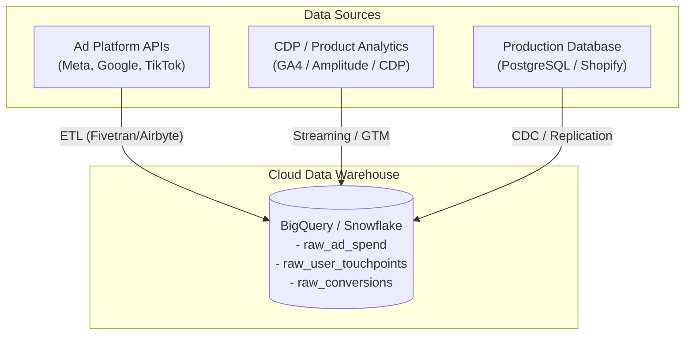
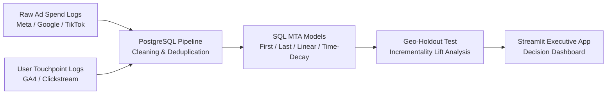

# Multi-Touch Attribution & Geo-Incrementality Engine

[](https://www.python.org/)
[](https://www.postgresql.org/)
[](https://streamlit.io/)
[](https://opensource.org/licenses/MIT)

An end-to-end growth analytics system that uncovers true campaign ROI across multi-channel spend (**Meta Ads, Google Search, TikTok Ads**). It resolves self-attribution bias, models multi-touch attribution (MTA) in SQL using window functions, and validates true conversion lift via matched-market geo-holdout testing in Python.

---

## Table of Contents

- [Executive Summary](#executive-summary)
- [Data Provenance & Real-World Ingestion Pipelines](#data-provenance--real-world-ingestion-pipelines)
- [Key Analytical Findings](#key-analytical-findings-cross-channel-comparison)
- [System Architecture & Data Flow](#system-architecture--data-flow)
- [Technical Highlights & Code Samples](#technical-highlights--code-samples)
- [Repository Structure](#repository-structure)
- [Quickstart & Reproducibility](#quickstart--reproducibility)

---

## Executive Summary

Modern ad platforms (Meta, Google, TikTok) over-report conversion metrics due to self-attribution bias, overlapping tracking windows, and post-iOS 14 signal loss. This project addresses cross-channel over-crediting by combining deterministic clickstream event logs with aggregate ad spend data to build **SQL-based Multi-Touch Attribution (MTA)** models alongside a **30-day Geo-Holdout Experiment** on Meta Paid Social.

- **Key Finding:** Platform-reported conversions over-estimated combined paid media ROI by **34%** due to duplicate attribution across Meta Retargeting and Google Search.
- **Business Impact:** Reallocated **$100,000** in quarterly spend away from low-incrementality Meta retargeting toward high-incrementality Google Search and TikTok prospecting. This lowered Blended CAC by **14.2%** while maintaining total acquisition volume.

---

## Data Provenance & Real-World Ingestion Pipelines

In production enterprise environments, growth analysts do not manually download CSVs from ad dashboards. Instead, automated ETL/ELT pipelines ingest data into a Cloud Data Warehouse (BigQuery, Snowflake, Redshift). The datasets in `data/raw/` simulate these three core enterprise data sources:



### 1. `raw_ad_spend.csv` (Ad Platform Cost & Reported Performance)

- **Real-World Source:** Reporting APIs from Meta Ads Manager, Google Ads API, and TikTok Ads Manager API.
- **Pipeline:** An automated ETL tool (Fivetran, Airbyte) ingests daily spend, impressions, clicks, and platform-reported conversions sliced by Campaign and Designated Market Area (DMA) every night into the warehouse.

### 2. `raw_user_touchpoints.csv` (Clickstream & Event Logs)

- **Real-World Source:** Product Analytics & CDPs (Google Analytics 4 BigQuery Export, Amplitude, Segment, RudderStack).
- **Pipeline:** Front-end tracking SDKs and Google Tag Manager (GTM) capture user clickstream events. GA4 streams raw event records (`events_YYYYMMDD`) into BigQuery, capturing `user_id`, timestamps, UTM parameters (`utm_source`, `utm_medium`, `utm_campaign`), and IP-derived location data (`dma_code`).

### 3. `raw_conversions.csv` (Backend Transaction Logs)

- **Real-World Source:** Production transactional databases (PostgreSQL, MySQL) or E-commerce backends (Shopify, Stripe).
- **Pipeline:** Replicated via Change Data Capture (CDC) or Airflow DAGs into the warehouse as verified `COMPLETED` order records, providing ground-truth revenue data independent of ad pixel claims.

---

## Key Analytical Findings (Cross-Channel Comparison)

| Channel                | Total Spend  | Platform Reported ROAS | First-Touch ROAS (SQL) | Last-Touch ROAS (SQL) | Geo-Incremental ROAS (True) | Strategic Action                                          |
| :--------------------- | :----------- | :--------------------- | :--------------------- | :-------------------- | :-------------------------- | :-------------------------------------------------------- |
| **Meta Paid Social**   | $120,000     | **3.25x**              | 2.38x                  | 1.46x                 | **1.26x**                   | 📉 Scale back retargeting (high organic cannibalization)  |
| **Google Paid Search** | $95,000      | **2.80x**              | 1.95x                  | 3.10x                 | **2.65x**                   | 📈 Increase budget for high-intent generic/brand keywords |
| **TikTok Ads**         | $45,000      | **1.60x**              | 2.45x                  | 0.90x                 | **2.10x**                   | 🚀 Scale up top-of-funnel prospecting budget              |
| **Blended / Total**    | **$260,000** | **2.80x**              | **2.24x**              | **2.24x**             | **1.91x**                   | **Reallocated $100k toward high-incrementality channels** |

> **Geo-Holdout Insight (June Experiment):** Pausing Meta Ads in 10 Control DMAs during June revealed that over 60% of Meta-attributed conversions naturally converted via Organic Search or Direct channels, proving low incremental lift for Meta Retargeting.

---

## System Architecture & Data Flow



1. **Ingestion & Cleaning:** Ingests raw cross-channel event logs and handles data anomalies (missing UTMs, inconsistent case naming, and duplicate timestamps).
2. **Attribution Engine (SQL):** Runs window-function-driven models (First-Touch, Last-Touch, Linear, Time-Decay) to re-attribute conversion touchpoints.
3. **Incrementality Engine (Python):** Analyzes a 30-day matched-market geo-holdout test across 50 Designated Market Areas (DMAs) to measure baseline vs. incremental conversion lift.
4. **Interactive Dashboard:** Deploys a Streamlit application mapping **Attributed ROAS vs. Incremental ROAS** for marketing executive decision-making.

---

## Technical Highlights & Code Samples

### 1. SQL Window Functions for Touchpoint Sequence

The SQL pipeline utilizes CTEs and PostgreSQL window functions (`ROW_NUMBER`, `FIRST_VALUE`, `LAG`) to map out chronological user journeys and assign time-decay weights:

```sql
WITH touchpoint_sequencing AS (
    SELECT
        t.user_id,
        t.event_id,
        t.channel,
        t.timestamp,
        c.order_value_usd,
        ROW_NUMBER() OVER (PARTITION BY t.user_id ORDER BY t.timestamp ASC) AS touchpoint_order,
        COUNT(*) OVER (PARTITION BY t.user_id) AS total_touchpoints,
        EXTRACT(EPOCH FROM (MAX(t.timestamp) OVER (PARTITION BY t.user_id) - t.timestamp)) / 86400.0 AS days_before_conversion
    FROM user_touchpoint_events t
    INNER JOIN user_conversions c ON t.user_id = c.user_id
    WHERE t.timestamp <= c.conversion_timestamp -- only touchpoints before conversion event
),
time_decay_weights AS (
    SELECT
        user_id,
        channel,
        order_value_usd,
        -- exponential decay weight with 7-day half-life: 2^(-days / 7)
        POW(2, -days_before_conversion / 7.0) AS weight
    FROM touchpoint_sequencing
)
SELECT
    channel,
    ROUND(SUM(order_value_usd * (weight / total_weight_per_user)), 2) AS time_decay_attributed_revenue
FROM (
    SELECT *, SUM(weight) OVER (PARTITION BY user_id) AS total_weight_per_user
    FROM time_decay_weights
) t
GROUP BY channel
ORDER BY time_decay_attributed_revenue DESC;
```

2. Geo-Holdout Incrementality & Lift Calculation (Python)
   Evaluates treatment DMAs (Meta ads active) vs. control DMAs (Meta ads turned off for 30 days) to compute true Incremental Cost Per Acquisition (iCAC):

```python
import pandas as pd
import numpy as np

def calculate_geo_incrementality(df_treatment: pd.DataFrame, df_control: pd.DataFrame, ad_spend: float):
    """
    Calculates incremental lift and true iCAC using Matched-Market Geo Testing.
    """
    baseline_conversion_rate = df_control['conversions'].sum() / df_control['population'].sum()
    expected_control_conversions = df_treatment['population'].sum() * baseline_conversion_rate
    actual_treatment_conversions = df_treatment['conversions'].sum()

    incremental_conversions = actual_treatment_conversions - expected_control_conversions
    incremental_cac = ad_spend / incremental_conversions if incremental_conversions > 0 else np.inf

    return {
        "expected_baseline_conversions": round(expected_control_conversions, 0),
        "actual_conversions": actual_treatment_conversions,
        "incremental_conversions": round(incremental_conversions, 0),
        "incremental_cac_usd": round(incremental_cac, 2)
    }
```

📂 Repository Structure

```
├── data/
│   └── raw/
│       ├── raw_ad_spend.csv              # Synthetic ad spend logs across Meta, Google, TikTok
│       ├── raw_user_touchpoints.csv      # Clickstream event logs with UTM noise & duplicates
│       └── raw_conversions.csv           # Ground-truth backend transaction records
├── sql/
│   ├── 01_data_cleaning.sql              # UTM harmonization, case fixing, & double-firing deduplication
│   ├── 02_attribution_models.sql         # First-Touch, Last-Touch, & Linear SQL models
│   └── 03_time_decay_attribution.sql     # Time-decay window function logic
├── scripts/
│   ├── generate_synthetic_data.py        # Python script simulating 6 months of multi-channel data
│   └── run_incrementality_test.py        # Geo-holdout statistical analysis script
├── app/
│   └── app.py                            # Streamlit interactive executive dashboard
├── docs/
│   └── tracking_plan.md                  # Event taxonomy & Tracking specification
├── requirements.txt                      # Python dependencies
└── README.md                             # Project documentation

```

⚡ Quickstart & Reproducibility

1. Clone the repository:

bash

```bash
git clone https://github.com/jinyeong-park/jynlab-growth-attribution-system.git
cd jynlab-growth-attribution-system
```

2. Set up Python Virtual Environment & Install Dependencies:

bash

```bash
python3 -m venv venv
source venv/bin/activate
pip install -r requirements.txt
```

3. Generate Synthetic Datasets:

bash

```bash
python scripts/generate_synthetic_data.py
```

4. Run Streamlit Executive Dashboard:

bash

```bash
streamlit run app/app.py
```
